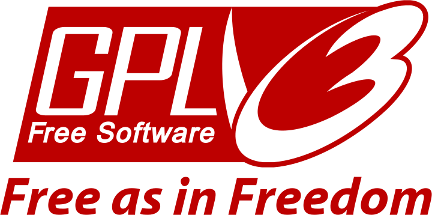

## Kisak COD
An open source fully-buildable reimplementation of Call of Duty 4's Multi-Player .exe

Aimed towards mod developers and COD4 enthusiasts.



Learn about the Development of KisakCOD here: [https://lwss.github.io/Duty-Of-Kisak/](https://lwss.github.io/Duty-Of-Kisak/)

### Current Requirements
- Windows OS
- Visual Studio
- CMake >= 3.16
- [DirectX SDK 2010](https://www.microsoft.com/en-us/download/details.aspx?id=6812)
- Steam with a copy of [Call of Duty 4](https://store.steampowered.com/app/7940/Call_of_Duty_4_Modern_Warfare_2007/)


### How to build
1) Install the above requirements and Clone repo
2) run `KisakCOD/mksln.bat` and `KisakCOD/mksln_dedi.bat`(DEDICATED)
3) Open .sln projects that are generated in `build/` and `build-dedi/` respectively ^^ 
4) Copy COD4 Game files to `${GIT_ROOT}/Debug/*` or `${GIT_ROOT}/Release/*` (Don't try to cherry-pick them, small files like localization.txt are needed)
5) Copy runtime DLL's to the same folder as above: `src/binklib/binkw32.dll` / `msslib/dlls/*`(Get the 'miles' folder containing .flt's as well) / `steam_api.dll`
6) Run the game via Visual Studio play button or just the .exe


```angular2html
Keep in Mind: This is a ~20 year old game with some known exploits. We will try to fix these as we become aware of them.
However, there is a non-zero chance of some type of binary exploitation when playing online. Use a sandbox (Sandboxie?) for peace of mind. 
```

### Known Issues
(Use the **[issues](https://github.com/SwagSoftware/KisakCOD/issues)** section)

### Troubleshooting
- ***Can't Connect to Dedicated Server*** :
  -  Check `net_ip` and `net_port`, the server will increment the port if the preferred one isn't available but the client won't sweep upwards.
 - ***DLL Error upon launch*** :
   - You didn't copy over the necessary runtime DLL's

## Credits and Special Thanks
- ***All Original COD4 Developers (for creating one of the best games of all time)***
- https://github.com/PJayB/jk3src (Jedi Academy fork with .sln)
- https://github.com/voron00/CoD2rev_Server - Useful yacc code for the gsc scripting here
- https://github.com/shiversoftdev/BO3Enhanced - Viewed as reference code for some of the Steam API Auth
- [RAD Game Tools](https://www.radgametools.com/) for their Bink and Miles Sound System libraries.
- [ODE Physics](https://www.ode.org/) COD4 uses a modified version of this physics engine.